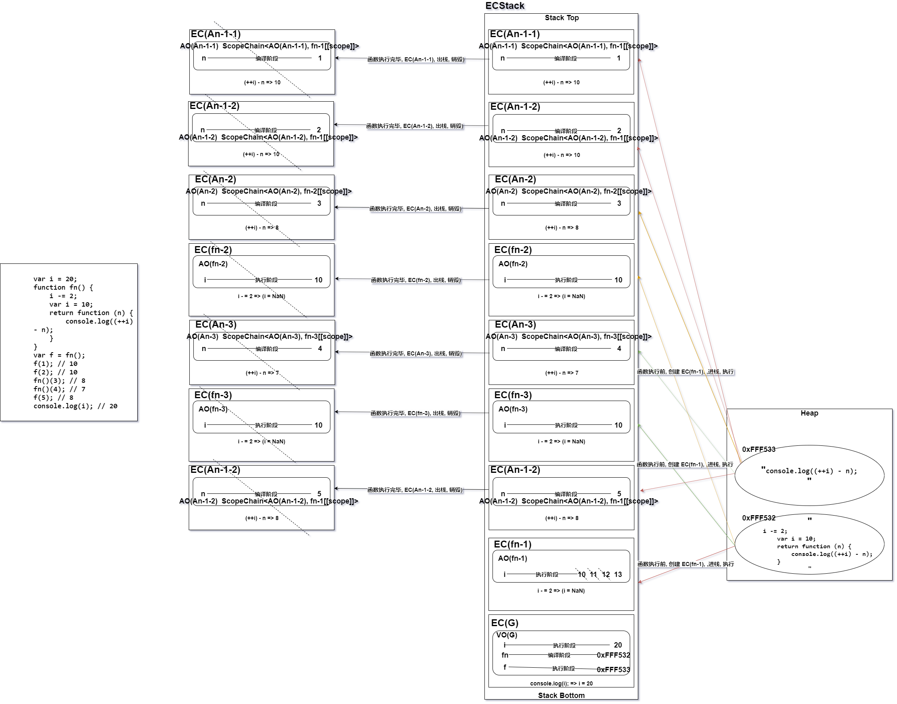
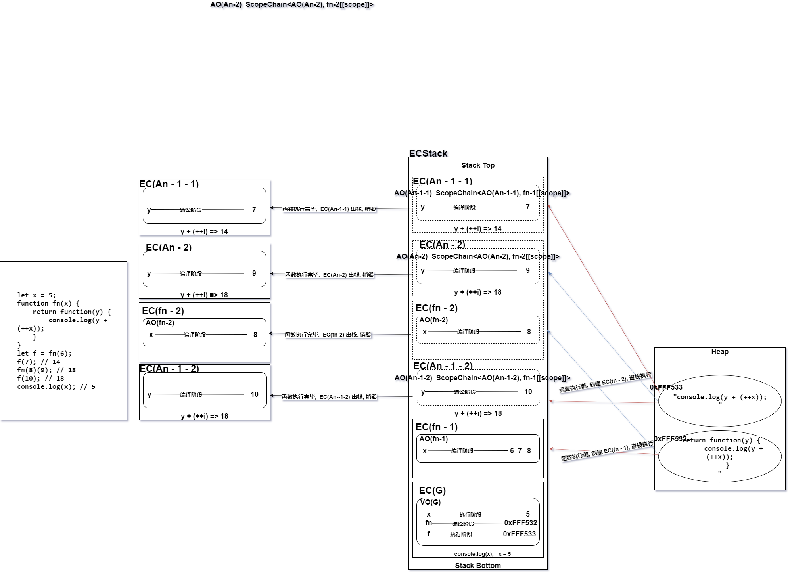
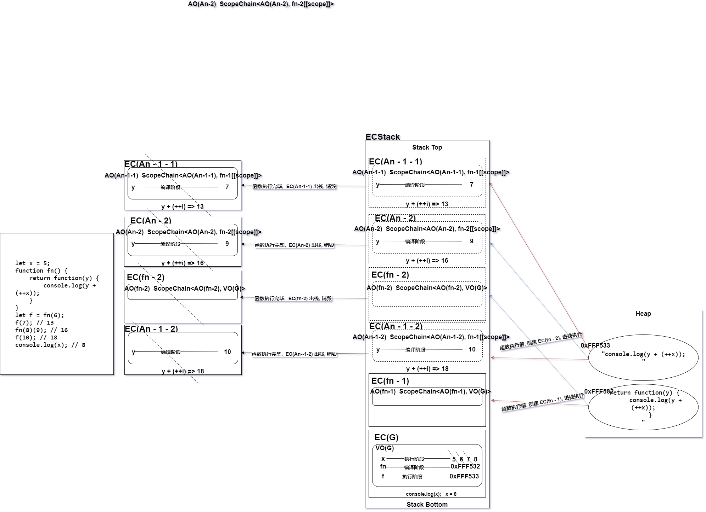
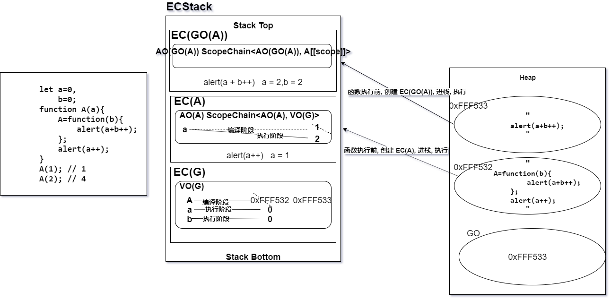
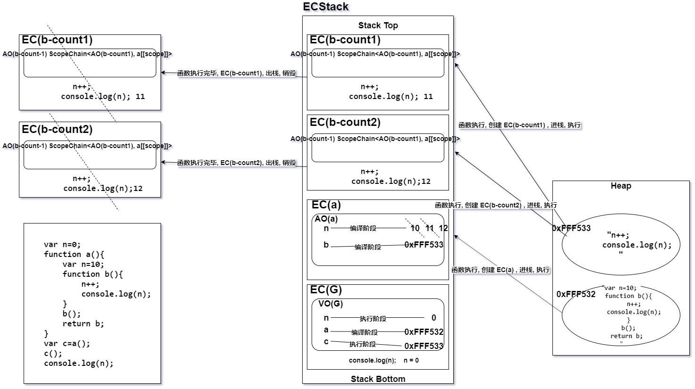
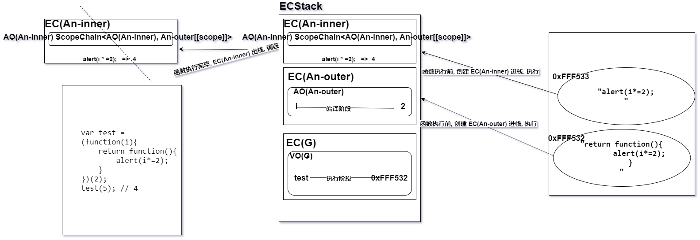

# JS作业(1) - 正式课(基础)
[TOC]
## 1. 写出下面代码输出的结果（画图）
```javascript
var i = 20;
function fn() {
    i -= 2;
    var i = 10;
    return function (n) {
        console.log((++i) - n);
    }
}
var f = fn();
f(1); // 10
f(2); // 10
fn()(3); // 8
fn()(4); // 7
f(5); // 8
console.log(i); // 20
```


## 2. 写出下面代码输出的结果 （画图）
```javascript
let x = 5;
function fn(x) {
    return function(y) {
        console.log(y + (++x));
    }
}
let f = fn(6);
f(7); // 14
fn(8)(9); // 18
f(10); // 18
console.log(x); // 5
```


## 3. 写出下面代码输出的结果 （画图）
```javascript
let x = 5;
function fn() {
    return function(y) {
        console.log(y + (++x));
    }
}
let f = fn(6);
f(7); // 13
fn(8)(9); // 16
f(10); // 18
console.log(x); // 8
```

# 4. 写出下面代码输出的结果 （画图）
```javascript
let a=0,
    b=0;
function A(a){
    A=function(b){
        alert(a+b++);
    };
    alert(a++);
}
A(1); // 1
A(2); // 4
```

## 5. 写出下面代码输出的结果 （画图）
```javascript
var n=0; 
function a(){
    var n=10; 
    function b(){
        n++; 
        console.log(n); 
    }
    b();
    return b; 
}
var c=a();
c(); 
console.log(n);
```

## 6. 写出下面代码输出的结果 （画图）
```javascript
var test = (function(i){
    return function(){
        alert(i*=2);
    }
})(2);
test(5); // 4
```

