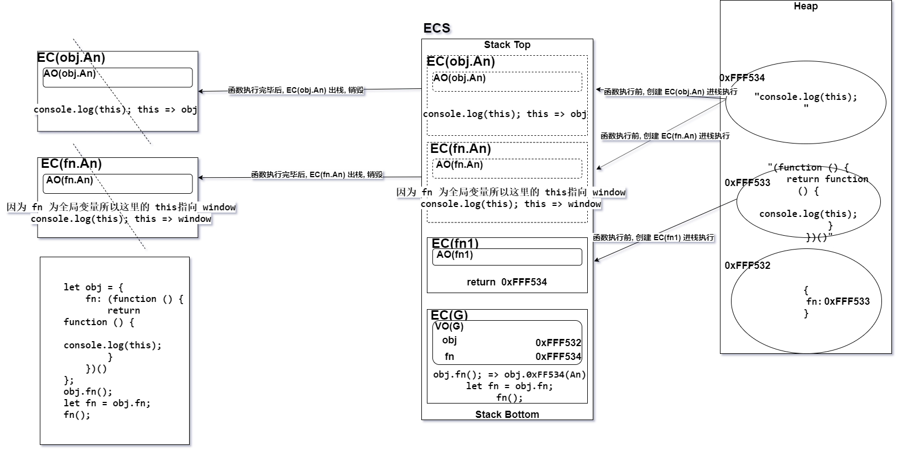

# JS 作业(3) - 正式课(基础)
[TOC]

## 1. 写出下面代码输出的结果（画图）
```javascript
let obj = {
    fn: (function () {
        return function () {
            console.log(this);
        }
    })()
};
obj.fn(); // obj
let fn = obj.fn;
fn(); // window
```
**解析 :** 当 JS 引擎初始化 obj 这个对象的时候, 执行到 fn 属性这块, 要为其赋值, 但是先要执行完自执行函数, 所以 obj.fn 就指向了自执行函数要返回的一个子函数(`这里将其称之为 A函数`)。所以 `obj.fn()` 实际上就是 `obj.A函数()` 所以  `A函数` 内部 this 指向的就是其调用者 obj, `obj.fn()` 执行完毕后当前的 `A 函数的执行上下文出栈销毁`, 但自执行函数因构成闭包被全局变量的 obj.fn 属性占用所以不能出栈销毁 。
继续向下执行, 将 `A函数的地址` 给了全局变量 fn, 相当于 `A函数` 在全局下执行默认 this 指向 window。

## 2. 写出下面代码输出的结果
```javascript
var fullName = 'language';
var obj = {
    fullName: 'javascript',
    prop: {
        getFullName: function () {
            return this.fullName;
        }
    }
};
console.log(obj.prop.getFullName()); // undefined
var test = obj.prop.getFullName;
console.log(test()); // 'language'
```
解析 : `obj.prop.getFullyName()` 实际上 `getFullName` 里面的 this 指向的就是 `prop` 所以 `prop` 没有 `fullName` 属性所以返回 undefined。
但把 `obj.prop.getFullName` 的地址给了全局变量 test, 然后 `test()` 相当于让 test 指向的那个函数在全局上下文下运行, 该函数内部 this 自然会指向 window。

## 3. 写出下面代码输出的结果
```javascript
var name = 'window';
var Tom = {
    name: "Tom",
    show: function () {
        console.log(this.name); // 'window'
    },
    wait: function () {
        var fun = this.show;
        fun();
    }
};
Tom.wait();
```
解析 : `Tom.wait()` 调用的就是 Tom 实例的 wait 方法, 所以 wait 里面 this 指向 Tom。故 fun 取得了 Tom 实例的 show 函数的引用。然后在没有其他对象调用的情况下在 wait 函数中自己调用, 则 show 函数中的 this 默认指向 window。
## 4. 写出下面代码输出的结果 （画图）
```javascript
window.val = 1;
var json = {
    val: 10,
    dbl: function () {
        this.val *= 2;
    }
}
json.dbl();
var dbl = json.dbl;
dbl();
json.dbl.call(window);
alert(window.val + json.val); // "24"
```

## 5. 写出下面代码输出的结果
```javascript
(function () {
    var val = 1;
    var json = {
        val: 10,
        dbl: function () {
            val *= 2;
        }
    };
    json.dbl();
    alert(json.val + val); // 12
})();
```
## 6. 写出下面代码输出的结果 （画图）
```javascript
var num = 10;
var obj = {
    num: 20
};
obj.fn = (function (num) {
    this.num = num * 3;
    num++;
    return function (n) {
        this.num += n;
        num++;
        console.log(num);
    }
})(obj.num);
var fn = obj.fn;
fn(5);
obj.fn(10);
console.log(num, obj.num);
```

## 7.  以下代码的功能是要实现为5个input按钮循环绑定click点击事件，绑定完成后点击1、2、3、4、5五个按钮分别会alert输出0、1、2、3、4五个字符。（腾讯）
- 请问如下代码是否能实现？
- 如果不能实现那么现在的效果是什么样的？
- 应该做怎样的修改才能达到我们想要的效果，并说明原理？
```html
<div id="btnBox">
    <input type="button" value="button_1" />
    <input type="button" value="button_2" />
    <input type="button" value="button_3" />
    <input type="button" value="button_4" />
    <input type="button" value="button_5" />
</div>
​
<script type="text/javascript">
    var btnBox=document.getElementById('btnBox'),
        inputs=btnBox.getElementsByTagName('input');
    var l=inputs.length;
    for(var i=0;i<l;i++){
        inputs[i].onclick=function(){
            alert(i);
        }
    }
</script>
```
答 : 
- 以上代码不能实现题目所述功能
- 目前效果为 : 点击五个 btn 都弹出 "5"。
- 原理 : 
	- 问题出现的原理 : 
	由于 JavaScript 的 ES5 之前的语法, 没有块级作用域的概念, for 循环中的 i 变量实际上是最为当前执行上下文的  变量对象 / 活动对象 的一个属性的形式而存在的, 当事件全部绑定完毕, 此时   变量对象 /  活动对象 上存储的 i 的值已经是最后的 5 了, 所以当事件触发函数执行的时候沿着作用域链访问到的 i 值就是循环后的 i 值。
	
	- 解决方案以及原理 : 
	
-1). 自定义属性方案 : 
```javascript
	for(var i=0;i<l;i++){
		inputs[i].index = i;
	     inputs[i].onclick=function(){
	         alert(this.index);
	     }
	 }
```		
实际上是通过在每个点击对象上设置一个属性来存储 i 值, 这样就会将每次循环的状态(所需要的 i 值) 保存下来, 当事件触发函数执行所访问的是对应自己的被点击元素的特定属性上存储的 i 值, 这样就可以实现题目所述效果。

-2). 闭包方案(自执行函数 / forEach) : 
```javascript
for(var i=0;i<l;i++){
        inputs[i].onclick = (function(index){
            return function() {
				alert(index);
			}
        })(i);
}
```
```javascript
Array.from(inputs).forEach((item, index) => {
	item.addEventListener('click', function() {
		alert(i);
	}, false);
});
```
通过每次迭代都创建一个新的执行上下文来存储本轮 i 的值, 这样当事件触发函数执行的时候就去自己对应的执行上下文中去寻找正确的 i 值。
-3). let 方案 : 
在 ES6 中使用 let 可以在当前代码块创建块级作用域, 并将自己与之绑定。for 循环的条件句柄处实际上是一个父级作用域, 而代码块体内则是子作用域, 每轮循环都会创建新的块级作用域来保存当前循环的 i 值, 当事件触发函数执行的时候就会到自己对应的块级作用域中去寻找 i 值, 所以这种方案也可以解决题目的问题。
```javascript
for(let i=0;i<l;i++){
        inputs[i].onclick=function(){
            alert(i);
        }
    }
```
## 8. 你理解的闭包作用是什么，优缺点？
**闭包 : (个人理解) :** 当一个函数能够记住并访问所在的词法作用域时, 就产生了闭包, 即使函数是在当前的词法作用域之外执行。
- 优点 :
	- 保护作用 : 闭包一旦形成外界是不可以直接访问到函数内部的私有变量的, 对函数内部数据是一种保护。并且可以防止全局变量污染,和变量命名冲突问题。
	- 保存作用 :  如果有全局变量对其引用则所在的执行上下文不会被释放, 其内部可访问的数据也都被保存下来。  
 - 缺点 :
	 - 如果大量使用闭包的话, 就会导致大量的私有内存得不到释放, 有可能造成内存泄漏, 所以应尽量减少闭包的使用频率, 如果必须使用请在特定时刻, 为其标记为待回收对象 `Xxx = null` 。

## 9. 简述let和var的区别
- 在全局上下文中 var 声明的变量不仅会被 VO(G) 保存起来而且还会挂载到 window 对象上, 但是 let 在全局上下文中声明的变量不能挂载到 window 对象上。
- var 声明变量时可以重复声明, 但是 let 声明变量不可以重复声明。
- var 有变量提升、let 没有变量提升。
- 因为 var 可以变量提升所以不存在暂时性死区的问题, 但是 let 没有变量提升在声明之前使用改变量就会导致暂时性死区。
- let 声明变量(除全局 / 函数 外)会在当前的代码块内形成块级作用域并绑定这块作用域。而 var 声明的变量不会!

## 10. 改造下面代码，使之输出0-9
```javascript
for (var i = 0; i < 10; i++) {
    setTimeout(() => {
        console.log(i);
    }, 1000);
}
```
改造 : <br>
-1). 闭包方式 : 
```javascript
for (var i = 0; i < 10; i++) {
    ((index) => {
        setTimeout(() => {
            console.log(index);
        }, 1000);
    })(i);
}
```
-2). let 方式 :
```javascript
for (let i = 0; i < 10; i++) {
    let flag = setTimeout(() => {
        console.log(i);
    }, 1000);
}
```
## 11. 下面代码输出的结果是多少，为什么？如何改造一下，就能让其输出 20 10？
```javascript
var b = 10;
(function b() {
    b = 20;
    console.log(b);
})();
console.log(b);
```
答 : 上面代码会输出 : b 函数 和 10。  <br>
原因 : JS 引擎在执行 js 代码的时候，在遇到一个变量, 首先会推断其是否是当前执行上下文中私有变量, 如果是就不再沿着作用域链去查找, 就本题而言, b 函数内部并没有私有变量 b 。更巧合的是自执行 b 函数与内部变量 b 重名, 这就导致内部变量 b 实际上是对 b 函数进行操作和修改, 与外部全局变量中的 b 没有关系, 但是在`自执行函数`内部对函数名进行操作都是无效的 。<br>

下面是几种改造方案 : <br>
-1). 将自执行函数内部的 b 置为其私有变量
```javascript
var b = 10;
(function b() {
   var b = 20;
    console.log(b);
})();
console.log(b);
```
-2). 传递一个形参, 为 b 函数内部营造私有变量
```javascript
var b = 10;
(function b(b) {
    b = 20;
    console.log(b);
})(20);
console.log(b);
```
-3). 将 b 函数名换一下, 然后在最后一次输出前将全局变量 b 变回 10
```javascript
var b = 10;
(function _b() {
   b = 20;
    console.log(b);
})();
b -= 10;
console.log(b);
```
