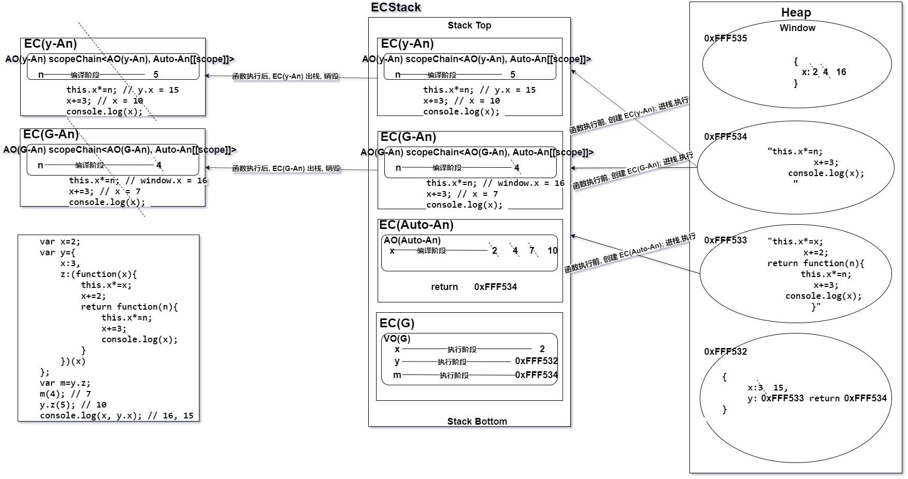
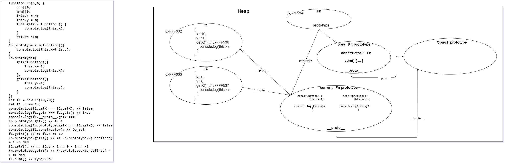
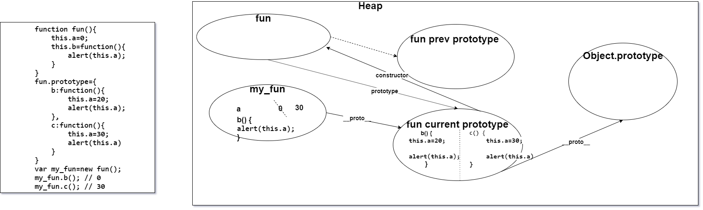
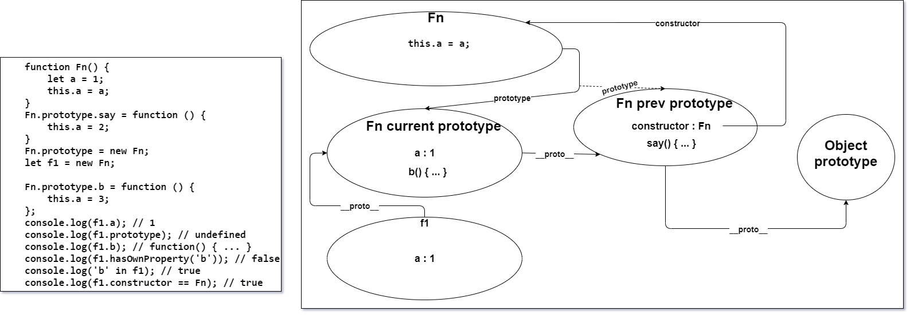
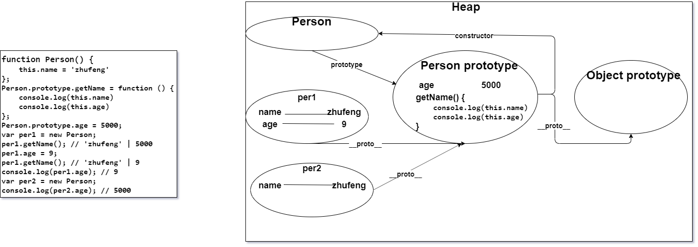

# JS 作业(4) - 正式课(基础)
[TOC]
## 1.  实现函数fn，让其具有如下功能（百度二面）
```javascript
let res = fn(1,2)(3);
console.log(res); //=>6  1+2+3
```
答案(借助单例模式搞一搞) : 
```javascript
let utils = (function() {

	function changeArray(arg) {
		return Array.from(arg);
	}
	function checkElements(arr) {
		return arr.map((item, index) => isNaN(Number(item)) ? 0 : Number(item));
	}
	return {
		changeArray,
		checkElements,
	};
})();

function fn() {
	let outer_arguments = utils.checkElements(utils.changeArray(arguments));
	return function() {
		let inner_arguments = utils.checkElements(utils.changeArray(arguments));
		let arr = outer_arguments.concat(inner_arguments );
		return arr.reduce((prev, next) => prev + next, 0);
	}	
}

let res = fn(1,2)(3);
console.log(res); //=>6  1+2+3
```
## 2.  写出下面代码输出的结果 （画图）
```javascript
var x=2;
var y={
    x:3,
    z:(function(x){
        this.x*=x;
        x+=2;
        return function(n){
            this.x*=n;
            x+=3;
            console.log(x); 
        }
    })(x)
};
var m=y.z;
m(4); // 7
y.z(5); // 10
console.log(x, y.x); // 16, 15
```


## 3.  写出下面代码的输出结果（画图）
```javascript
function Fn(n,m) {
    n=n||0;
    m=m||0;
    this.x = n;  f1(x => 10)  f2(x => 0)
    this.y = m;  f1(y => 20)  f2(y => 0)
    this.getX = function () {
        console.log(this.x);
    }
    return n+m;
}
Fn.prototype.sum=function(){
    console.log(this.x+this.y);
}
Fn.prototype={
    getX:function(){
        this.x+=1;
        console.log(this.x);
    },
    getY:function(){
        this.y-=1;
        console.log(this.y);
    }
};
let f1 = new Fn(10,20);
let f2 = new Fn;
console.log(f1.getX === f2.getX); // false
console.log(f1.getY === f2.getY); // true
console.log(f1.__proto__.getY === Fn.prototype.getY); // true
console.log(Fn.prototype.getX === f2.getX); // false
console.log(f1.constructor); // Object
f1.getX(); // 10
Fn.prototype.getX(); // NaN
f2.getY(); // -1
Fn.prototype.getY(); // NaN
f1.sum(); // TypeError
```


## 4.  写出下面代码输出的结果（画图 腾讯面试题）
```javascript
function fun(){
    this.a=0;
    this.b=function(){
        alert(this.a);
    }
}
fun.prototype={
    b:function(){
        this.a=20;
        alert(this.a);
    },
    c:function(){
        this.a=30;
        alert(this.a)
    }
}
var my_fun=new fun();
my_fun.b(); // 0
my_fun.c(); // 30
```


## 5.  写出下面代码输出的结果 （百度面试题）
```javascript
function C1(name) {
    if (name) {
        this.name = name;
    }
}
function C2(name) {
    this.name = name;
}
function C3(name) {
    this.name = name || 'join';
}
C1.prototype.name = 'Tom';
C2.prototype.name = 'Tom';
C3.prototype.name = 'Tom';
alert((new C1().name) + (new C2().name) + (new C3().name)); // "Tomundefinedjoin"
```

## 6.  写出下面代码输出的结果 （画图）
```javascript
function Fn() {
    let a = 1;
    this.a = a;
}
Fn.prototype.say = function () {
    this.a = 2;
}
Fn.prototype = new Fn;
let f1 = new Fn;
​
Fn.prototype.b = function () {
    this.a = 3;
};
console.log(f1.a); // 1
console.log(f1.prototype); // undefined
console.log(f1.b); // function() { ... }
console.log(f1.hasOwnProperty('b')); // false
console.log('b' in f1); // true
console.log(f1.constructor == Fn); // true
```


## 7.  写出下面代码输出的结果 （画图）
```javascript
function Person() {
    this.name = 'zhufeng'
};
Person.prototype.getName = function () {
    console.log(this.name)
    console.log(this.age)
};
Person.prototype.age = 5000;

var per1 = new Person;
per1.getName(); // 'zhufeng' | 5000
per1.age = 9; 
per1.getName(); // 'zhufeng' | 9
console.log(per1.age); // 9
var per2 = new Person;
console.log(per2.age); // 5000
```


## 8. 编写程序实现如下效果 （百度面试题）
```javascript
let n = 10;
let m = n.plus(10).minus(5);
console.log(m);//=>15（10+10-5）
```
答案 : 
```javascript
Number.prototype.plus = function(num) {
	return this + checkType(num);
};
Number.prototype.minus = function(num) {
	return this - checkType(num);
};
function checkType(arg) {
	let num = Number(arg);
	return Number.isNaN(num) ? 0 : num ;
}
let n = 10;
let m = n.plus(10).minus(5);
console.log(m);//=>15（10+10-5）
```

## 9. 编写程序实现如下效果 （经典面试题）
```javascript
let ary = [12,23,12,13,13,12,23,14,8];
ary.unique().sort((a,b)=>a-b);
//=> 最后的ary等于[8,12,13,14,23]
```
答案 : 
```javascript
Array.prototype.unique = function() {
	let arr = checkType(this);
	return [...(new Set(arr))];
};
function checkType(arr) {
	
	return arr.filter((item, index) => !Number.isNaN(Number(item)));
}
let ary = [12,23,12,13,13,12,23,14,8];
ary.unique().sort((a,b)=>a-b);
//=> 最后的ary等于[8,12,13,14,23]
```

## 10. 一个url后面好多key:value，如localhost?key=val&key2=val2&key3=val3，封装一个函数 getParam(‘key’) 通过key获得相应等号后面的值（百度面试题）
```javascript
let url="locallhost?key1=val1&key2=val2&key3=val3";
console.log(url.getParam("key3")); 
//=>'val3'
```
答案 : 
```javascript
String.prototype.getParam = function(arg) {
    let _this = this;
	let obj = {};
	let a = _this.replace(/([^#&=?]+)=([^#&=?]+)/g, ($, key, val) => obj[key] = val);
	return obj[arg];
};
let url="locallhost?key1=val1&key2=val2&key3=val3";
console.log(url.getParam("key3")); 
//=>'val3'
```

## 附加作业
### 1. 情人节福利题：重构内置new方法
```javascript
function Dog(name) {
    this.name = name;
}
Dog.prototype.bark = function () {
    console.log('wangwang');
}
Dog.prototype.sayName = function () {
    console.log('my name is ' + this.name);
}
/*
let sanmao = new Dog('三毛');
sanmao.sayName();
sanmao.bark();
*/
//=>基于内置的new关键词，我们可以创建Dog的一个实例sanmao，实例可以调取原型上的属性和方法，现在的需求是：自己实现一个_new方法，也能模拟出内置new后的结果
function _new() {
    //=>完成你的代码

}
let sanmao = _new(Dog, '三毛');
sanmao.bark(); //=>"wangwang"
sanmao.sayName(); //=>"my name is 三毛"
console.log(sanmao instanceof Dog); //=>true
```
答案 : 
```javascript
function Dog(name) {
    this.name = name;
}
Dog.prototype.bark = function () {
    console.log('wangwang');
}
Dog.prototype.sayName = function () {
    console.log('my name is ' + this.name);
}
function _new(className, name) {
    //=>完成你的代码
	let obj = { name };	
	obj.__proto__ = className.prototype;
	return obj;
}
let sanmao = _new(Dog, '三毛');
sanmao.bark(); //=>"wangwang"
sanmao.sayName(); //=>"my name is 三毛"
console.log(sanmao instanceof Dog); //=>true
```
### 2. 下面代码a在什么值情况下会输出1
```javascript
var a = ?;
if (a == 1 && a == 2 && a == 3) {
    console.log(1);
}
```
`==` 在进行数据类型转换的时候如果是引用类型则默认会调用 valueOf 方法,然后再调用 toString 方法, 因此我们可以直接改写 toString 方法来实现每调用一次都自增 1。

答案如下 :

写法一 : 
```javascript
var a = (function() {
    let count = 0;
    return { // valueOf 与 toString 任选其一即可(默认走 valueOf)
        toString() { 
            return ++count;
        },
        valueOf() {
			return ++count;
		}
    }
})();
if (a == 1 && a == 2 && a == 3) {
    console.log(1); // 1
}
```
写法二 : 
```javascript
var a = {
	count: 1,
	toString() {
		return a.count++;
	}
};
if (a == 1 && a == 2 && a == 3) {
    console.log(1); // 1
}
```
### 3. 下面代码的输出结果？为什么？
```javascript
let obj = {
    2: 3,
    3: 4,
    length: 2,
    push: Array.prototype.push
}
obj.push(1);
obj.push(2);
console.log(obj); // { 2: 1, 3: 2, length: 4, push: f }
```
做这道题必须熟悉 push 方法的工作原理。
> push 方法根据 length 属性来决定从哪里开始插入给定的值。如果 length 不能被转成一个数值，则插入的元素索引为 0, 包括 length 不存在时。当 length 不存在时，将会创建它。           
> --- 摘自 MDN • [Array.prototype.push](https://developer.mozilla.org/zh-CN/docs/Web/JavaScript/Reference/Global_Objects/Array/push)

就是说 Array.prototype.push 方法是根据调用元素的 length 属性进行插入的, 针对本题来说, 至于本题的 obj 可以使用 Array.prototype.push 方法的原因代码层面已经说明, 就不做阐述。
针对本题而言, 在执行 push 方法的时候正好发现了该目标元素有 length 属性所以不会重新造一个新的 length 来用。所以在执行 Array.prototype.push 方法进行添加的时候就会从索引 `2` 这个位置开始添加, 执行完 `obj.push(1)、obj.push(2)` 后, 相当于 `obj[2] = 1、obj[3] = 2;` 然后依次将 length 属性自增 `2` 个单位就变成了 `4`, 所以 obj 最终的结果为 { 2: 1, 3: 2, length: 4, push: f }

如果将 length 一开始改为 `4` 那么最终的结果将为 { 2: 3, 3: 4, 4: 1, 5: 2, length: 6, push: f }
### 4. 阿里超经典面试题
```javascript
function Foo() {
    getName = function () {
        console.log(1);
    };
    return this;
}
Foo.getName = function () {
    console.log(2);
};
Foo.prototype.getName = function () {
    console.log(3);
};
var getName = function () {
    console.log(4);
};
function getName() {
    console.log(5);
}
Foo.getName(); // 2
getName(); // 4
Foo().getName(); // 1 
getName(); // 1
new Foo.getName(); // 2
new Foo().getName(); // 3
new new Foo().getName(); // 3
```
-1). `Foo.getName();` 不解释, 直接调用的 `Foo.getName` 函数 -> 打印 2。

-2). `getName();` 这块涉及变量提升, 声明式的被先声明 + 定义了, 所以代码执行到表达式那里就被重新赋值了, 所以打印的是 4。

-3). `Foo().getName();` 单纯调用函数返回的 this 指向 window, 所以这里执行完 Foo(), 此时全局的上下文中的 getName 方法被替换成了 `function (){console.log(1);}` 所以再执行输出 1 。

-4).  `getName();` 访问的也是全局的所以输出 1。

-5).  `new Foo.getName();` 是先将 `Foo.getName` 划分为一个整体, 然后才 new 的, 换句话说 new 的是 `Foo.getName` 而不是 `Foo`。所以输出 2。

-6).  `new Foo().getName();` 先实例化 Foo(), 然后调用其实例的原型上的 `getName` 方法。故输出 3 。

-7). `new new Foo().getName();` 先执行 `new Foo()`得到 Foo 的实例, 然后将 `Foo的实例.getName()` 划分为一个整体，最后执行最外层的 `new Foo的实例.getName()`， 也就是 new 一个 Foo 实例所属原型上的 `getName` 方法, 所以最后输出 3。

本题 4、5、6 涉及到运算符的优先级 : 

`new 不代参数列表 < new 代参数列表` => `new Xxx < new Xxx()`

`new 与 调用操作符( . ) 是平级的, 但 点儿 是从左到右执行的`。

详见 MDN 文档  --- [运算符的优先级](https://developer.mozilla.org/zh-CN/docs/Web/JavaScript/Reference/Operators/Operator_Precedence)