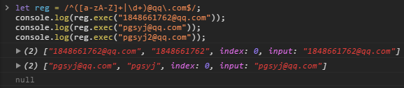

# JS 作业(6) - 正式课(基础)
[TOC]

## 题目

- 1). 编写一个正则   可以匹配用户输入的手机号是否合法
手机号码规则来源 : 

**分析 :**
当前号段为 : 
> 130 131 132 133 134 135 136 137 138 139
145 147 149
150 151 152 153 155 156 157 158 159
162 166 
172 173 175 176 177 178
180 181 182 183 184 185 186 187 188 189
192 195 196 197 198  

得到正则为 : `/^1((3\d)|(4[579])|(5[012356789])|(6[26])|(7[235678])|(8\d)|(9[25678]))\d{8}$/`
简化为 : `/^1(([38]\d)|(4[579])|(5[0-35-9])|(6[26])|(7[235-8])|(9[25-8]))\d{8}$/` 
```javascript
let reg = /^1(([38]\d)|(4[579])|(5[0-35-9])|(6[26])|(7[235-8])|(9[25-8]))\d{8}$/;
let str = "17803218829"; // 号段存在的号码
console.log(reg.exec(str)); // ["17803218829", index: 0, input: "17803218829"]
str = "14603218829"; // 号段不存在的号码
console.log(reg.exec(str)); // null
```


- -2). 编写一个正则   可以匹配有效数字
因未说明该题有效数字的定义, 姑且认为这些值为有效数字 : `0.1`、`1`、`+0.1`、`-.1`、`-1`、`+1`、`8.95`
**分析**
- 第一位可以是正负号, 如果出现只能出现一次。
- 可以出现小数点, 如果出现只能出现一次。
得到正则为 : `/^[+-]?\d*(?:\.)?\d+$/`

```javascript
let reg = /^[+-]?\d*(?:\.)?\d+$/;
console.log(reg.exec("0.156")); // ["0.156", index: 0, input: "0.156"]
console.log(reg.exec("+0.156")); // ["+0.156", index: 0, input: "+0.156"]
console.log(reg.exec("-.15")); // ["-.15", index: 0, input: "-.15"]
console.log(reg.exec("156")); // ["156", index: 0, input: "156"]
console.log(reg.exec("+156")); // ["+156", index: 0, input: "+156"]
console.log(reg.exec("-156")); // ["-156", index: 0, input: "-156"]
console.log(reg.exec("5.")); // null
console.log(reg.exec("5+")); // null
```


-  -3). 编写一个正则  可以匹配 QQ 邮箱
QQ邮箱 @ 符前面可以是 纯数字也可以是纯字母
得正则为 : `/^([a-zA-Z]+|\d+)@qq\.com$/`
```javascript
let reg = /^([a-zA-Z]+|\d+)@qq\.com$/;
console.log(reg.exec("1848661762@qq.com")); // ["1848661762@qq.com", "1848661762", index: 0, input: "1848661762@qq.com"]
console.log(reg.exec("pgsyj@qq.com")); // ["pgsyj@qq.com", "pgsyj", index: 0, input: "pgsyj@qq.com"]
console.log(reg.exec("pgsyj2@qq.com")); // null
```

- -4). 编写一个正则   匹配身份证号码
身份证正则构成 :
> 前 6 位 : 地址码 【数字 => [1-9]\d{5}】
7~10位 : 出生年份 【数字 =>(18|19|20) -> 目前只想匹配到 20 年】
11~12位 : 月份	【数字 => (0[1-9]|1[0-2])】
13~14位 : 日期	【数字 => ([0-2][1-9]) | [1,2,3]0|31】
15~17位 : 顺序码 【数字 => \d{3}】
最后一位 : 校验码 【数字或者X / x => [0-9Xx]】

由此可得正则 : `/[1-9]\d{5}(?:18|19|20)\d{2}(?:0[1-9]|1[0-2])(?:(?:[0-2][1-9])|[1,2,3]0|31)\d{3}[0-9Xx]/`
```javascript
let reg = /[1-9]\d{5}(?:18|19|20)\d{2}(?:0[1-9]|1[0-2])(?:(?:[0-2][1-9])|[1,2,3]0|31)\d{3}[0-9Xx]/;
console.log(reg.exec("130827197608050032")); // ["130827197608050032", index: 0, input: "130827197608050032"]
console.log(reg.exec("130824129608050032")); // null
```


- -5). 编写一个正则   匹配 18 ~ 65 之间的整数
得正则为 : `/^(1[89]|[2-5]\d|6[1-5])$/`
```javascript
let reg = /^(1[89]|[2-5]\d|6[1-5])$/;
console.log(reg.exec("17")); // null
console.log(reg.exec("18")); // ["18", "18", index: 0, input: "18"]
console.log(reg.exec("25")); // ["25", "25", index: 0, input: "25"]
console.log(reg.exec("30")); // ["30", "30", index: 0, input: "30"]
console.log(reg.exec("45")); // ["45", "45", index: 0, input: "45"]
console.log(reg.exec("52")); // ["52", "52", index: 0, input: "52"]
console.log(reg.exec("65")); // ["65", "65", index: 0, input: "65"]
console.log(reg.exec("66")); // null
```


- -6). 编写一个正则   匹配用户输入的密码是否符合规则(8~18位、既有大写字母、小写字母和数字)
得正则为 : `/(?!^[a-z0-9]{8,18}$)(?!^[A-Z0-9]{8,18}$)(?!^[a-zA-Z]{8,18}$)^[a-zA-Z0-9]{8,18}$/`
```javascript
let reg = /(?!^[a-z0-9]{8,18}$)(?!^[A-Z0-9]{8,18}$)(?!^[a-zA-Z]{8,18}$)^[a-zA-Z0-9]{8,18}$/;
console.log(reg.exec("121212121")); // null
console.log(reg.exec("sasasasaa")); // null
console.log(reg.exec("SASASASAA")); // null
console.log(reg.exec("sasasaSAA")); // null
console.log(reg.exec("12121212s")); // null
console.log(reg.exec("12121212S")); // null
console.log(reg.exec("12121212Sa")); // ["12121212Sa", index: 0, input: "12121212Sa"]
```


